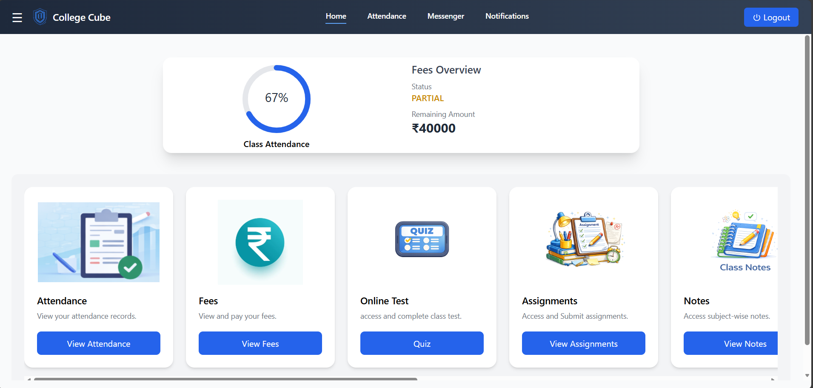
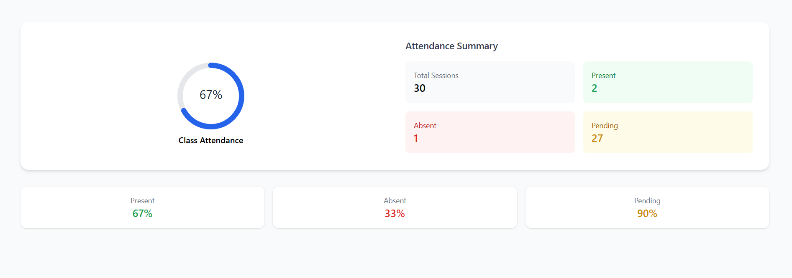
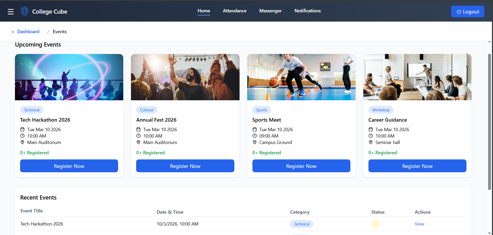
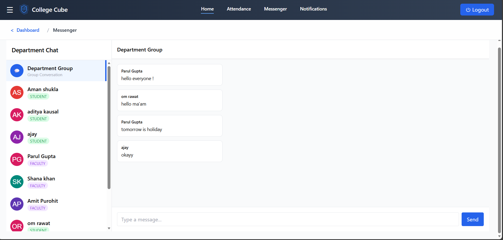
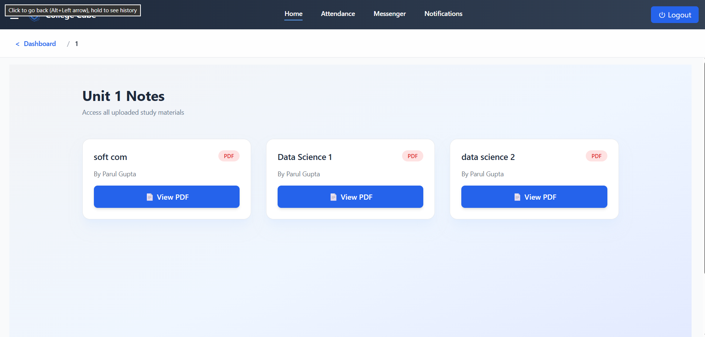

# 🎓 College Cube – Multi-College SaaS ERP System

College Cube is a **full-stack MERN-based College ERP platform** built using a **multi-college SaaS architecture**.

The system is designed to allow multiple colleges to use the same ERP platform while maintaining strict college-level data isolation.

---

## 🚀 Key Features

### 👨‍💼 Admin – College Owner

- College-based SaaS signup
- Manage Departments
- Create and manage Faculty
- Create and manage Students
- Event Management System
- Fees Management with Razorpay
- Attendance Monitoring
- Real-time Department Messenger
- Role-based Dashboard
- College-level data isolation

### 👨‍🏫 Faculty

- Faculty Dashboard
- Mark Student Attendance
- 30-Day Attendance Cycle System
- View Student Attendance Summary
- Participate in Department Chat
- View College Events

### 👨‍🎓 Student

- Student Dashboard
- View Attendance Summary
- Pay Fees via Razorpay
- Register for Events
- Real-time Messaging
- View Notes
- Notes organized by Department → Subject → Unit

---

## 🏗️ Architecture Highlights

### Multi-College SaaS Architecture

Each Admin represents a college.

The application uses `collegeId` to maintain strict data isolation between different colleges.

### 🔐 Role-Based Access Control

The system supports:

- Admin
- Faculty
- Student

JWT authentication is used for secure authentication and authorization.

JWT contains:

```text
userId
role
collegeId

---

## 📸 Screenshots

### 🏠 Dashboard


### 📊 Attendance Management


### 💰 Fees Management


### 📅 Event Management


### 💬 Department Messenger


### 📝 Notes Management


---


## 📸 Screenshots

### 🏠 Dashboard


### 📊 Attendance Management


### 💰 Fees Management


### 📅 Event Management


### 💬 Department Messenger


### 📝 Notes Management

